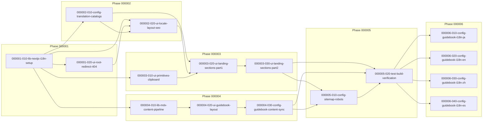

# Task Dependency Graph

## Phase 000001 — Foundation
- `000001-010-lib-nextjs-i18n-setup` → (root)
- `000001-020-ui-root-redirect-404` → depends on `000001-010-lib-nextjs-i18n-setup`

## Phase 000002 — Content & Locale Shell
- `000002-010-config-translation-catalogs` → depends on `000001-010-lib-nextjs-i18n-setup`
- `000002-020-ui-locale-layout-seo` → depends on `000001-010-lib-nextjs-i18n-setup`, `000001-020-ui-root-redirect-404`, `000002-010-config-translation-catalogs`

## Phase 000003 — Landing Page UI
- `000003-010-ui-primitives-clipboard` → depends on `000001-010-lib-nextjs-i18n-setup`
- `000003-020-ui-landing-sections-part1` → depends on `000002-010-config-translation-catalogs`, `000002-020-ui-locale-layout-seo`, `000003-010-ui-primitives-clipboard`
- `000003-030-ui-landing-sections-part2` → depends on `000002-010-config-translation-catalogs`, `000002-020-ui-locale-layout-seo`, `000003-010-ui-primitives-clipboard`, `000003-020-ui-landing-sections-part1`

## Phase 000004 — Guidebook Section (Korean-only v1)
- `000004-010-lib-mdx-content-pipeline` → depends on `000001-010-lib-nextjs-i18n-setup`
- `000004-020-ui-guidebook-layout` → depends on `000001-010-lib-nextjs-i18n-setup`, `000004-010-lib-mdx-content-pipeline`
- `000004-030-config-guidebook-content-sync` → depends on `000004-010-lib-mdx-content-pipeline`, `000004-020-ui-guidebook-layout`

## Phase 000005 — SEO & Verification
- `000005-010-config-sitemap-robots` → depends on `000003-030-ui-landing-sections-part2`, `000004-030-config-guidebook-content-sync`
- `000005-020-test-build-verification` → depends on `000003-030-ui-landing-sections-part2`, `000004-030-config-guidebook-content-sync`, `000005-010-config-sitemap-robots`

## Phase 000006 — Guidebook Locale Expansion
- `000006-010-config-guidebook-i18n-ja` → depends on `000005-020-test-build-verification`
- `000006-020-config-guidebook-i18n-en` → depends on `000005-020-test-build-verification`
- `000006-030-config-guidebook-i18n-zh` → depends on `000005-020-test-build-verification`
- `000006-040-config-guidebook-i18n-es` → depends on `000005-020-test-build-verification`

## Parallel Execution Notes

- **Initial ready set**: `000001-010-lib-nextjs-i18n-setup` (유일한 root task; 이 프로젝트의 모든 task가 직접 또는 간접적으로 이 task에서 파생됨)
- After `000001-010-lib-nextjs-i18n-setup` merges, the following become runnable in parallel: `000001-020-ui-root-redirect-404`, `000002-010-config-translation-catalogs`, `000003-010-ui-primitives-clipboard`, `000004-010-lib-mdx-content-pipeline` (네 task 모두 Ownership이 disjoint하며 서로 다른 파일/디렉터리를 소유함)
- After `000001-020-ui-root-redirect-404`, `000002-010-config-translation-catalogs` merge (in addition to `000001-010`), `000002-020-ui-locale-layout-seo` becomes runnable
- After `000002-010-config-translation-catalogs`, `000002-020-ui-locale-layout-seo`, `000003-010-ui-primitives-clipboard` merge, `000003-020-ui-landing-sections-part1` becomes runnable
- After `000004-010-lib-mdx-content-pipeline` merges, `000004-020-ui-guidebook-layout` becomes runnable; Phase 000004 can proceed in parallel with Phase 000002/000003 since it only depends on `000001-010`
- **Hard sequencing (Conflicts With)**: `000003-020-ui-landing-sections-part1`과 `000003-030-ui-landing-sections-part2`는 둘 다 `src/app/[locale]/page.tsx`를 수정하므로 절대 동시에 실행해서는 안 된다 — `000003-020`이 완전히 merge된 후에만 `000003-030`을 시작한다
- After `000003-030-ui-landing-sections-part2`와 `000004-030-config-guidebook-content-sync` 모두 merge되면 `000005-010-config-sitemap-robots`가 runnable해지고, 이어서 `000005-020-test-build-verification`이 runnable해진다
- **Phase 000005 → 000006 hard gate**: `000005-020-test-build-verification`이 완전히 merge되기 전까지 Phase 000006의 어떤 task도 시작할 수 없다 (사용자가 명시적으로 "마지막 task 이후"로 지정)
- **Phase 000006 내부 병렬성**: `000006-010`(ja), `000006-020`(en), `000006-030`(zh), `000006-040`(es)은 `000005-020` 완료 후 서로 완전히 병렬로 실행 가능하다 — 4개 task 모두 `src/content/guidebook/<locale>/**`라는 서로 disjoint한 디렉터리만 소유하며 Conflicts With가 없다

## Visual Dependency Graph

## Open Questions

1. **Phase 000004/000006이 검증된 spec 범위를 벗어남**: `docs/specification/`은 현재 단일 페이지 마케팅 랜딩 페이지만 다루며, `01-overview.md`의 Out of Scope는 블로그/콘텐츠 관리 체계를 명시적으로 제외한다. Guidebook(Phase 000004/000006)은 세션 중간에 사용자가 추가한 신규 범위이므로, Phase 000004 착수 전 `ywc-spec-writer`로 `docs/specification/08-guidebook.md`를 작성해 정식 spec 근거를 마련하는 것을 권장한다. 현재 Phase 000004/000006의 모든 task는 `develop-with-llm/docs/guides/guidebook/README.md`(외부 저장소)만을 근거로 진행되고 있다.
2. **Guidebook 06–12 페이지가 upstream에서 계속 작성 중**: `develop-with-llm` 저장소에는 현재 01–05 페이지만 존재하며, 06–12는 계속 작성되고 있다. `000004-030-config-guidebook-content-sync`의 sidebar TOC 와이어링(그룹/순서/제목)은 06–12가 upstream에 추가로 작성될 때마다 재확인이 필요하다.
3. **Phase 000006의 정확한 번역 범위는 Phase 000006 착수 시점에 확정**: `000006-010`/`020`/`030`/`040` 각 locale task가 번역해야 할 정확한 페이지 수는, 그 task가 실제로 시작되는 시점에 `src/content/guidebook/ko/`에 몇 개의 페이지가 존재하는지(즉 06–12 중 얼마나 upstream에서 완성되었는지)에 따라 달라진다. Phase 000005 완료 시점과 Phase 000006 착수 시점 사이에 upstream 콘텐츠가 추가될 수 있으므로, 각 locale task 착수 직전에 `src/content/guidebook/ko/` 파일 목록을 다시 확인해야 한다.
