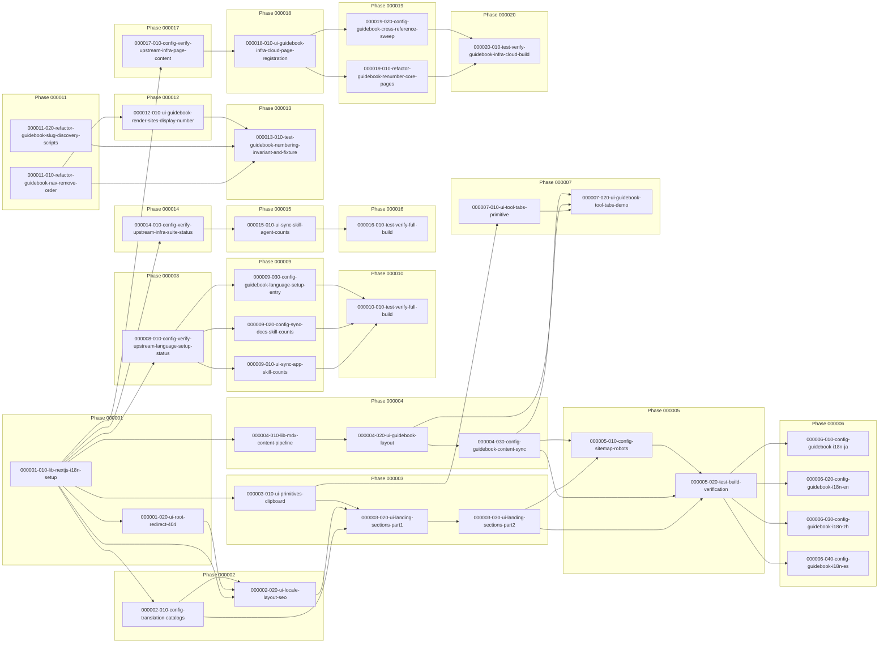

# Task Dependency Graph

## Phase 000001 — Foundation
- `000001-010-lib-nextjs-i18n-setup` → (root)
- `000001-020-ui-root-redirect-404` → depends on `000001-010-lib-nextjs-i18n-setup`

## Phase 000002 — Content & Locale Shell
- `000002-010-config-translation-catalogs` → depends on `000001-010-lib-nextjs-i18n-setup`
- `000002-020-ui-locale-layout-seo` → depends on `000001-010-lib-nextjs-i18n-setup`, `000001-020-ui-root-redirect-404`, `000002-010-config-translation-catalogs`

## Phase 000003 — Landing Page UI
- `000003-010-ui-primitives-clipboard` → depends on `000001-010-lib-nextjs-i18n-setup`
- `000003-020-ui-landing-sections-part1` → depends on `000002-010-config-translation-catalogs`, `000002-020-ui-locale-layout-seo`, `000003-010-ui-primitives-clipboard`
- `000003-030-ui-landing-sections-part2` → depends on `000002-010-config-translation-catalogs`, `000002-020-ui-locale-layout-seo`, `000003-010-ui-primitives-clipboard`, `000003-020-ui-landing-sections-part1`

## Phase 000004 — Guidebook Section (Korean-only v1)
- `000004-010-lib-mdx-content-pipeline` → depends on `000001-010-lib-nextjs-i18n-setup`
- `000004-020-ui-guidebook-layout` → depends on `000001-010-lib-nextjs-i18n-setup`, `000004-010-lib-mdx-content-pipeline`
- `000004-030-config-guidebook-content-sync` → depends on `000004-010-lib-mdx-content-pipeline`, `000004-020-ui-guidebook-layout`

## Phase 000005 — SEO & Verification
- `000005-010-config-sitemap-robots` → depends on `000003-030-ui-landing-sections-part2`, `000004-030-config-guidebook-content-sync`
- `000005-020-test-build-verification` → depends on `000003-030-ui-landing-sections-part2`, `000004-030-config-guidebook-content-sync`, `000005-010-config-sitemap-robots`

## Phase 000006 — Guidebook Locale Expansion
- `000006-010-config-guidebook-i18n-ja` → depends on `000005-020-test-build-verification`
- `000006-020-config-guidebook-i18n-en` → depends on `000005-020-test-build-verification`
- `000006-030-config-guidebook-i18n-zh` → depends on `000005-020-test-build-verification`
- `000006-040-config-guidebook-i18n-es` → depends on `000005-020-test-build-verification`

## Phase 000007 — Guidebook Tool Tabs (Claude Code / Codex)
> spec: `docs/ywc-plans/guidebook-tool-tabs.md` (`ywc-spec-validate` DONE). Numbered as a new phase (append-only, `highest existing phase + 1`) rather than inserted into Phase 000004, per explicit user direction during generation — another concurrent session was actively executing tasks through the existing phase sequence, so inserting new sequence numbers mid-Phase-000004 risked a numbering/ordering collision. The true task-level dependencies below are narrower than the phase-level hard gate implies (see note).
- `000007-010-ui-tool-tabs-primitive` → depends on `000003-010-ui-primitives-clipboard`
- `000007-020-ui-guidebook-tool-tabs-demo` → depends on `000007-010-ui-tool-tabs-primitive`, `000004-020-ui-guidebook-layout`, `000004-030-config-guidebook-content-sync`

## Phase 000008 — Upstream Language-Setup Sync: Verification Gate
> spec: `docs/ywc-plans/sync-skill-count-language-setup.md` (`ywc-spec-validate` DONE, 9회 검증 라운드 후 수렴). upstream `ywc-agent-toolkit` PR #125가 계획 시점 `state: OPEN`, `mergedAt: null`이었으므로, 이 배치의 모든 숫자 편집은 Phase 000008의 재검증 결과에 의해 게이팅된다.
- `000008-010-config-verify-upstream-language-setup-status` → (Phase 000008/000009/000010의 root; Phase 000007과 독립적으로 시작 가능)

## Phase 000009 — Upstream Language-Setup Sync: Content Updates
- `000009-010-ui-sync-app-skill-counts` → depends on `000008-010-config-verify-upstream-language-setup-status`
- `000009-020-config-sync-docs-skill-counts` → depends on `000008-010-config-verify-upstream-language-setup-status`
- `000009-030-config-guidebook-language-setup-entry` → depends on `000008-010-config-verify-upstream-language-setup-status`

## Phase 000010 — Upstream Language-Setup Sync: Final Verification
- `000010-010-test-verify-full-build` → depends on `000009-010-ui-sync-app-skill-counts`, `000009-020-config-sync-docs-skill-counts`, `000009-030-config-guidebook-language-setup-entry`

## Phase 000011 — Guidebook Page Numbering Refactor: Foundation
> spec: `docs/ywc-plans/guidebook-page-numbering-refactor.md` (`ywc-spec-ready` DONE after 1 validate+re-plan cycle + 1 confirming re-check, 9 Critical resolved via Iteration 1 Amendments). Assigned Phase 000011 via append-only numbering (`highest existing phase 000010` + 1) — this phase's tasks do not actually depend on any Phase 000001–000010 task; they depend only on the already-merged codebase state at the time this batch was generated.
- `000011-010-refactor-guidebook-nav-remove-order` → (root of this batch; independent of Phase 000001–000010)
- `000011-020-refactor-guidebook-slug-discovery-scripts` → (root of this batch; independent of `000011-010` and of Phase 000001–000010)

## Phase 000012 — Guidebook Page Numbering Refactor: Render Sites
- `000012-010-ui-guidebook-render-sites-display-number` → depends on `000011-010-refactor-guidebook-nav-remove-order`

## Phase 000013 — Guidebook Page Numbering Refactor: Verification
- `000013-010-test-guidebook-numbering-invariant-and-fixture` → depends on `000011-010-refactor-guidebook-nav-remove-order`, `000011-020-refactor-guidebook-slug-discovery-scripts`, `000012-010-ui-guidebook-render-sites-display-number`

## Phase 000014 — Upstream Infra-Suite Sync: Verification Gate
> spec: `docs/ywc-plans/sync-skill-count-infra-suite-pr131.md` (`ywc-spec-ready` DONE, Iteration 1 Amendments 후 수렴 — Fix 1 consistency, Fix 2 completeness, Fix 3 feasibility, Fix 4 completeness 4건의 Critical/Warning 해소). upstream `ywc-agent-toolkit` PR #131이 계획 시점 `state: OPEN`, `mergedAt: null`이었으므로, 이 배치의 모든 숫자 편집은 Phase 000014의 재검증 결과에 의해 게이팅된다. Task 생성 시 `--mode llm`로 지정되어 Phase 000009~000010(human 모드, 5개 task)보다 적은 3개 task로 수직 통합했다.
- `000014-010-config-verify-upstream-infra-suite-status` → (Phase 000014/000015/000016의 root; Phase 000001~000013과 독립적으로 시작 가능)

## Phase 000015 — Upstream Infra-Suite Sync: Content Updates
- `000015-010-ui-sync-skill-agent-counts` → depends on `000014-010-config-verify-upstream-infra-suite-status`

## Phase 000016 — Upstream Infra-Suite Sync: Final Verification
- `000016-010-test-verify-full-build` → depends on `000015-010-ui-sync-skill-agent-counts`

## Phase 000017 — Guidebook Infra & Cloud 신규 페이지: 사전 검증 게이트
> spec: `docs/ywc-plans/guidebook-infra-cloud-page-pr131.md` (`ywc-spec-ready` DONE, 2회 iteration 후 수렴 — Critical 2건은 A1/A2 amendment로, Warning 5건은 A3-A7 amendment로 해소). 형제 스펙 `sync-skill-count-infra-suite-pr131.md`(Phase 000014-016, 이미 실행 완료)와 upstream PR #131을 공유하지만 범위가 완전히 disjoint하다(가이드북 콘텐츠 vs. 마케팅 카피 숫자) — 이 spec은 두 스펙 중 어느 순서로도, 혹은 병렬로 실행 가능하다고 명시한다. Task 생성 시 `--mode llm`로 지정되어 5개 task로 수직 통합했다.
- `000017-010-config-verify-upstream-infra-page-content` → (Phase 000017/000018/000019/000020의 root; Phase 000001~000016과 독립적으로 시작 가능)

## Phase 000018 — Guidebook Infra & Cloud 신규 페이지: 등록 및 콘텐츠 작성
- `000018-010-ui-guidebook-infra-cloud-page-registration` → depends on `000017-010-config-verify-upstream-infra-page-content`

## Phase 000019 — Guidebook Infra & Cloud 신규 페이지: 리넘버링 캐스케이드
- `000019-010-refactor-guidebook-renumber-core-pages` → depends on `000018-010-ui-guidebook-infra-cloud-page-registration`
- `000019-020-config-guidebook-cross-reference-sweep` → depends on `000018-010-ui-guidebook-infra-cloud-page-registration`

## Phase 000020 — Guidebook Infra & Cloud 신규 페이지: 최종 검증
- `000020-010-test-verify-guidebook-infra-cloud-build` → depends on `000019-010-refactor-guidebook-renumber-core-pages`, `000019-020-config-guidebook-cross-reference-sweep`

## Parallel Execution Notes

- **Initial ready set**: `000001-010-lib-nextjs-i18n-setup` (유일한 root task; 이 프로젝트의 모든 task가 직접 또는 간접적으로 이 task에서 파생됨)
- After `000001-010-lib-nextjs-i18n-setup` merges, the following become runnable in parallel: `000001-020-ui-root-redirect-404`, `000002-010-config-translation-catalogs`, `000003-010-ui-primitives-clipboard`, `000004-010-lib-mdx-content-pipeline` (네 task 모두 Ownership이 disjoint하며 서로 다른 파일/디렉터리를 소유함)
- After `000001-020-ui-root-redirect-404`, `000002-010-config-translation-catalogs` merge (in addition to `000001-010`), `000002-020-ui-locale-layout-seo` becomes runnable
- After `000002-010-config-translation-catalogs`, `000002-020-ui-locale-layout-seo`, `000003-010-ui-primitives-clipboard` merge, `000003-020-ui-landing-sections-part1` becomes runnable
- After `000004-010-lib-mdx-content-pipeline` merges, `000004-020-ui-guidebook-layout` becomes runnable; Phase 000004 can proceed in parallel with Phase 000002/000003 since it only depends on `000001-010`
- **Hard sequencing (Conflicts With)**: `000003-020-ui-landing-sections-part1`과 `000003-030-ui-landing-sections-part2`는 둘 다 `src/app/[locale]/page.tsx`를 수정하므로 절대 동시에 실행해서는 안 된다 — `000003-020`이 완전히 merge된 후에만 `000003-030`을 시작한다
- After `000003-030-ui-landing-sections-part2`와 `000004-030-config-guidebook-content-sync` 모두 merge되면 `000005-010-config-sitemap-robots`가 runnable해지고, 이어서 `000005-020-test-build-verification`이 runnable해진다
- **Phase 000005 → 000006 hard gate**: `000005-020-test-build-verification`이 완전히 merge되기 전까지 Phase 000006의 어떤 task도 시작할 수 없다 (사용자가 명시적으로 "마지막 task 이후"로 지정)
- **Phase 000006 내부 병렬성**: `000006-010`(ja), `000006-020`(en), `000006-030`(zh), `000006-040`(es)은 `000005-020` 완료 후 서로 완전히 병렬로 실행 가능하다 — 4개 task 모두 `src/content/guidebook/<locale>/**`라는 서로 disjoint한 디렉터리만 소유하며 Conflicts With가 없다
- **Phase 000007 numbering note**: `000007-010`은 실제로는 `000003-010`에만 의존하고, `000007-020`은 `000007-010` + `000004-020` + `000004-030`에만 의존한다 — 즉 이 Phase는 기술적으로 Phase 000005/000006 완료를 필요로 하지 않는다. 그럼에도 append-only 번호 배정 규칙(및 다른 세션이 기존 phase 순서를 실행 중이라는 동시성 제약)에 따라 Phase 000007로 배정했으므로, "Phase N+1은 Phase N 전체 완료 후" 하드 게이트를 문자 그대로 적용하면 Phase 000007은 Phase 000006(4개 locale 확장 task)까지 끝난 뒤에야 시작 가능한 것으로 읽힌다. 실제 실행 시 이 hard gate를 완화해 `000007-010`/`000007-020`을 각자의 실제 `Depends On` 목록이 충족되는 즉시 시작해도 안전하다 — 단, 이 완화를 적용할지는 이 프로젝트의 task 순차 실행 컨벤션을 따르는 실행자가 최종 판단한다.
- **Phase 000008 numbering note**: `000008-010`은 실제로는 `000001-010`(프로젝트 root) 외에 어떤 기존 task에도 의존하지 않는다 — Phase 000002~000007의 어떤 task도 선행 조건이 아니다. Append-only 번호 배정 규칙에 따라 highest existing phase(`000007`) + 1로 배정했을 뿐이며, 실제 실행 시 이 하드 게이트를 완화해 Phase 000002~000007과 완전히 독립적으로, 심지어 그보다 먼저 시작해도 기술적으로 안전하다 — Phase 000007과 마찬가지로 완화 적용 여부는 실행자가 최종 판단한다.
- **Phase 000008 → 000009 hard gate (진짜 하드 게이트, 완화 대상 아님)**: `000008-010`이 PR #125 unmerged를 기록하면 Phase 000009의 세 task는 어떤 것도 시작할 수 없다 — 이것은 append-only 번호 배정의 인위적 부산물이 아니라, spec이 명시한 실제 도메인 제약(스펙 `## Scope`의 Stop condition)이다.
- **Phase 000009 내부 병렬성**: `000009-010`(앱 코드/디자인 템플릿), `000009-020`(문서), `000009-030`(가이드북)은 `000008-010` 완료 후 서로 완전히 병렬로 실행 가능하다 — 세 task 모두 서로 disjoint한 파일만 소유하며 Conflicts With가 없다.
- **Phase 000011 numbering note**: `000011-010`과 `000011-020`은 Phase 000001~000010의 어떤 task에도 의존하지 않는다 — append-only 번호 배정 규칙에 따라 highest existing phase(`000010`) + 1로 배정했을 뿐이며, 실제로는 이 저장소의 어느 시점에서든(Phase 000001 완료 직후부터도) 독립적으로 시작 가능하다.
- **Phase 000011 내부 병렬성**: `000011-010`(타입/데이터 레이어)과 `000011-020`(스크립트 slug 파생)은 서로 다른 파일을 소유하며(`guidebook-nav.ts`/`guidebook-content.ts`/`guidebook-nav-content.ts` vs. `scripts/generate-search-index.mjs`/`scripts/generate-sitemap.mjs`) `guidebookNavGroups`의 `slug` 필드만 공유(양쪽 다 읽기 전용 또는 무관)하므로 완전히 병렬 실행 가능하다.
- **Phase 000011 → 000012 hard gate**: `000012-010`은 `000011-010`이 만드는 `LocalizedGuidebookPageMeta`/`displayNumber` 타입 없이는 타입 체크를 통과할 수 없다 — 진짜 하드 게이트.
- **Phase 000012 → 000013 hard gate**: `000013-010`의 AC6 fixture 검증은 4개 렌더 사이트가 이미 `displayNumber`를 표시하고 있어야 end-to-end로 의미 있는 검증이 된다 — 진짜 하드 게이트. 또한 `000013-010`은 `guidebook-nav.ts`를 fixture 목적으로 일시 편집하므로 `000011-010`이 완전히 merge된 이후에만 시작해야 파일 충돌을 피할 수 있다.
- **Phase 000014 numbering note**: `000014-010`은 실제로는 `000001-010`(프로젝트 root) 외에 어떤 기존 task에도 의존하지 않는다 — Phase 000002~000013의 어떤 task도 선행 조건이 아니다. Append-only 번호 배정 규칙에 따라 highest existing phase(`000013`) + 1로 배정했을 뿐이며, 실제 실행 시 이 하드 게이트를 완화해 Phase 000002~000013과 완전히 독립적으로, 심지어 그보다 먼저 시작해도 기술적으로 안전하다 — 완화 적용 여부는 실행자가 최종 판단한다.
- **Phase 000014 → 000015 hard gate (진짜 하드 게이트, 완화 대상 아님)**: `000014-010`이 PR #131 unmerged를 기록하면 `000015-010`은 시작할 수 없다 — 이것은 append-only 번호 배정의 인위적 부산물이 아니라, spec이 명시한 실제 도메인 제약(스펙 `## Scope`의 Stop condition)이다.
- **Phase 000014/000015/000016 llm 모드 통합**: 이 배치는 `ywc-task-generator --mode llm`로 생성되었다 — Phase 000009(human 모드)가 앱 코드/문서/가이드북 3개 task로 병렬 분해했던 것과 달리, 이번 배치는 가이드북 콘텐츠 동기화가 애초에 이 스펙의 범위 밖(형제 스펙 `guidebook-infra-cloud-page-pr131.md` 책임)이고 남은 앱 코드+문서 동기화가 하나의 일관된 수직 슬라이스(총 16개 파일, llm 모드 예산 ~25개 파일 이내)로 간주되어 `000015-010` 단일 task로 통합했다. 따라서 Phase 000009와 달리 Phase 000015 내부에는 병렬 실행 가능한 여러 task가 없다.
- **Phase 000017 numbering note**: `000017-010`은 실제로는 `000001-010`(프로젝트 root) 외에 어떤 기존 task에도 의존하지 않는다 — Phase 000002~000016의 어떤 task도 선행 조건이 아니다. Append-only 번호 배정 규칙에 따라 highest existing phase(`000016`) + 1로 배정했을 뿐이며, 실제 실행 시 이 하드 게이트를 완화해 Phase 000002~000016과 완전히 독립적으로, 심지어 그보다 먼저 시작해도 기술적으로 안전하다 — 완화 적용 여부는 실행자가 최종 판단한다.
- **Phase 000017 → 000018 게이트 (소프트, 형제 스펙과 다름)**: 형제 스펙(Phase 000014→000015)의 PR merge 하드 게이트와 달리, 이 spec은 `## Dependencies`에서 PR merge를 "soft dependency, not a hard blocker"로 명시한다 — `000017-010`이 PR을 unmerged로 기록하더라도 `000018-010`은 in-flight diff 기준으로 진행 가능하다. `000017-010` → `000018-010` 의존은 merge 상태가 아니라 4개 신규 skill의 실제 커맨드 문법(ToolTabs 예제 소싱 근거) 제공 때문이다.
- **Phase 000019 내부 병렬성**: `000019-010`(직접 리넘버링 4개 페이지 + A-Z 테이블)과 `000019-020`(A1 추가 교차 참조 4개 페이지 + README + skill-links.ts)은 `000018-010` 완료 후 서로 완전히 병렬로 실행 가능하다 — 두 task 모두 Ownership이 완전히 disjoint한 파일 세트만 소유하며 Conflicts With가 없다.
- **Phase 000017/000018/000019/000020 llm 모드 통합**: 이 배치는 `ywc-task-generator --mode llm`로 생성되었다. 원자적 3-way 등록 요구(A3: nav + slugs + 5개 로케일 콘텐츠가 같은 커밋에 있어야 `generate-search-index.mjs`가 실패하지 않음)로 인해 `000018-010`은 mode와 무관하게 단일 task로 유지된다. 리넘버링 캐스케이드(원래 45개 이상의 파일에 걸침)는 human 모드였다면 로케일당 또는 관심사당 훨씬 많은 수의 task로 쪼개졌겠지만, llm 모드에서는 파일 소유권이 disjoint한 2개의 수직 슬라이스(`000019-010`/`000019-020`)로만 분해했다.

## Visual Dependency Graph

## Open Questions

1. **Phase 000004/000006이 검증된 spec 범위를 벗어남**: `docs/specification/`은 현재 단일 페이지 마케팅 랜딩 페이지만 다루며, `01-overview.md`의 Out of Scope는 블로그/콘텐츠 관리 체계를 명시적으로 제외한다. Guidebook(Phase 000004/000006)은 세션 중간에 사용자가 추가한 신규 범위이므로, Phase 000004 착수 전 `ywc-spec-writer`로 `docs/specification/08-guidebook.md`를 작성해 정식 spec 근거를 마련하는 것을 권장한다. 현재 Phase 000004/000006의 모든 task는 `develop-with-llm/docs/guides/guidebook/README.md`(외부 저장소)만을 근거로 진행되고 있다.
2. **Guidebook 06–12 페이지가 upstream에서 계속 작성 중**: `develop-with-llm` 저장소에는 현재 01–05 페이지만 존재하며, 06–12는 계속 작성되고 있다. `000004-030-config-guidebook-content-sync`의 sidebar TOC 와이어링(그룹/순서/제목)은 06–12가 upstream에 추가로 작성될 때마다 재확인이 필요하다.
3. **Phase 000006의 정확한 번역 범위는 Phase 000006 착수 시점에 확정**: `000006-010`/`020`/`030`/`040` 각 locale task가 번역해야 할 정확한 페이지 수는, 그 task가 실제로 시작되는 시점에 `src/content/guidebook/ko/`에 몇 개의 페이지가 존재하는지(즉 06–12 중 얼마나 upstream에서 완성되었는지)에 따라 달라진다. Phase 000005 완료 시점과 Phase 000006 착수 시점 사이에 upstream 콘텐츠가 추가될 수 있으므로, 각 locale task 착수 직전에 `src/content/guidebook/ko/` 파일 목록을 다시 확인해야 한다.
4. **Phase 000007의 Codex placeholder 커맨드**: `000007-020`의 데모(`03-quickstart.md`)에 들어갈 Codex 패널 커맨드는 upstream(`develop-with-llm`)에 아직 실제 Codex 대응 커맨드가 문서화되어 있지 않아 대표성 있는 placeholder로 진행한다(`docs/ywc-plans/guidebook-tool-tabs.md` Open Questions #1). 실제 Codex 커맨드가 upstream에 추가되면 재검토가 필요하다.
5. **Phase 000007과 Phase 000005/000006 사이의 hard-gate 완화 여부**: 위 Parallel Execution Notes의 "Phase 000007 numbering note" 참고 — append-only 번호 배정으로 인해 문자 그대로는 Phase 000006 완료가 선행 조건처럼 보이지만, 실제 task-level Depends On은 더 이른 시점에 충족된다. 순차 실행 시 이 완화를 적용할지 실행자가 판단해야 한다.
6. **Phase 000008 착수 시점에 PR #125가 여전히 unmerged일 가능성**: 스펙 작성 시점에 `ywc-agent-toolkit` PR #125는 `state: OPEN`, `mergedAt: null`이었다. `000008-010`이 실제 실행되는 시점에도 여전히 unmerged라면, 그 task는 Stop Condition에 따라 즉시 멈추고 Phase 000009/000010은 실행하지 않는다 — 이는 이 배치 전체의 진짜 하드 블로커이며(append-only 번호 배정의 인위적 산물이 아님), 다른 저장소(`ywc-agent-toolkit`)의 소유자가 PR을 merge해야 해소된다.
7. **`gh` CLI 실행 환경 전제조건**: `000008-010`은 `gh` CLI가 설치·인증되어 있고 `yongwoon/ywc-agent-toolkit`(이 프로젝트와 다른 저장소)에 대한 read 권한이 있다고 가정한다. 실행 환경(worktree, CI, sandbox 등)에 따라 이 전제조건이 충족되지 않을 수 있으므로, `000008-010` 착수 전 실행 환경에서 `gh auth status`로 사전 확인을 권장한다.
8. **`000009-010`의 발산(divergent) 분기에서 Feature Grid blocking 처리의 구체적 형태**: 스펙 FR-5는 "사람이 해결할 때까지 편집을 생성하지 말라"는 blocking을 요구하지만, 그 blocking이 `000009-010` task 내부의 Stop Condition으로 표현되는지, 아니면 별도의 대기 task로 분리되어야 하는지는 이 task 분해에서 전자(기존 `000009-010` 내부 Stop Condition)로 판단했다 — `000008-010`의 판정이 발산일 경우, `000009-010` 실행자는 hero/featureGrid.description 전환까지만 수행하고 카테고리 산술 편집은 수행하지 않은 채 보고해야 한다(해당 task의 Notes 참고). 발산이 실제로 발생하면 이 처리가 충분한지 재검토가 필요할 수 있다.
9. **Phase 000014 착수 시점에 PR #131이 여전히 unmerged일 가능성**: 스펙 작성 시점에 `ywc-agent-toolkit` PR #131은 `state: OPEN`, `mergedAt: null`이었다(단, `ywc-spec-ready` 검증 과정에서 `gh pr view 131`을 조회했을 때는 이미 `MERGED`, `mergedAt: 2026-07-08T21:16:34Z`로 확인된 바 있다 — 이는 spec-validate 시점의 관찰이며, `000014-010` 실행 시점에도 반드시 재조회해야 한다). `000014-010`이 실제 실행되는 시점에 unmerged로 나오면 Stop Condition에 따라 즉시 멈추고 Phase 000015/000016은 실행하지 않는다.
10. **`000015-010`의 발산(divergent) 분기 처리 방식은 `000009-010`과 동일한 패턴을 재사용**: FR-4b의 blocking을 별도 task로 분리하지 않고 `000015-010` 내부 Stop Condition/Implementation Steps 분기로 표현했다(Open Question #8과 동일한 판단 근거). 발산이 실제로 발생하면 재검토가 필요할 수 있다.
11. **신규 Feature Grid 카테고리("Infrastructure & Cloud")의 정확한 label/description 문구**: 스펙은 lane(`codex`)과 value(산술)만 확정하고 정확한 label 문구는 예시로만 제시한다(`## Iteration 1 Amendments` Fix 1 참고) — `000015-010` 실행자가 en.json 작성 시 최종 문구를 확정하고, 이후 4개 로케일이 그 문구를 따라간다.
12. **신규 Guidebook 페이지("Managing Cloud Infrastructure")의 정확한 title/description 문구**: `docs/ywc-plans/guidebook-infra-cloud-page-pr131.md`의 Open Questions에서 실행자 재량으로 남겨져 있다 — `000018-010` 실행자가 `en/17-infrastructure-and-cloud.md` 작성 시 최종 문구를 확정하고, `guidebook-nav.ts`의 `title`/`description`과 나머지 4개 로케일이 그 결정을 따라간다.
13. **README.md에 인프라 파이프라인 전용 Quick Links 행을 추가할지 여부**: 같은 spec의 Open Questions에서 실행자 재량으로 남겨져 있다(AC4 충족에는 불필요) — `000019-020` 실행자가 판단한다.
14. **`000017-010` 착수 시점에 PR #131의 실제 상태**: 이 task 분해 생성 시점에 `gh pr view 131 --repo yongwoon/ywc-agent-toolkit`을 직접 조회한 결과 이미 `MERGED`(`mergedAt: 2026-07-08T21:16:34Z`, `headRefOid: 513df53499c5e4f82ce23349d3eb614fcf65a33a`)로 확인되었다 — 형제 스펙(Phase 000014)의 하드 블로커와 달리 이 spec은 PR merge를 하드 블로커로 두지 않으므로(`## Dependencies`), `000017-010`이 실제 실행되는 시점에 재조회한 결과가 다시 unmerged로 나오더라도 `000018-010`은 진행 가능하다 — 다만 `000017-010`은 실행 시점의 실제 조회 결과를 캐시된 값 대신 기록해야 한다.
